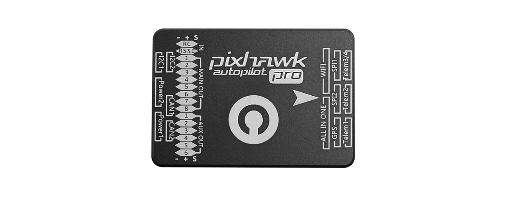

# Pixhawk 3 PRO integration

The **Pixhawk 3 Pro** autopilot is an advanced system designed by **Drotek** and **PX4**. It features advanced processor and sensor technology from ST Microelectronics and a NuttX real-time operating system, delivering incredible performance, flexibility, and reliability for controlling any autonomous vehicle. It was built in order to be **plug-&-play** with the Drotek RTK modules, and is extremely reliable in RTK applications, as well as common vehicle controlling applications.

