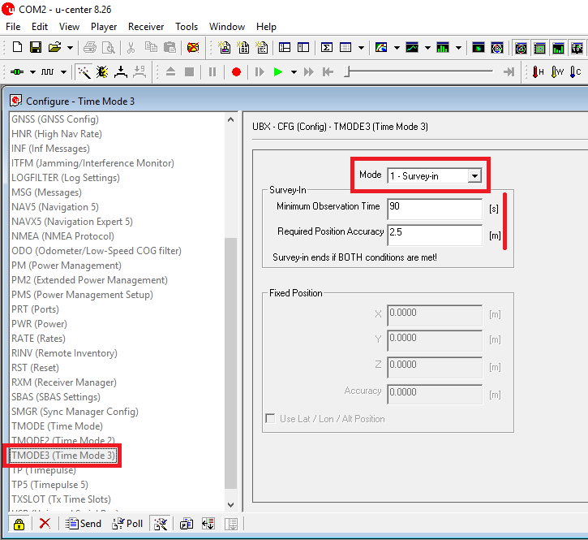
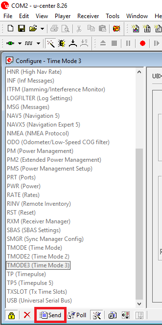
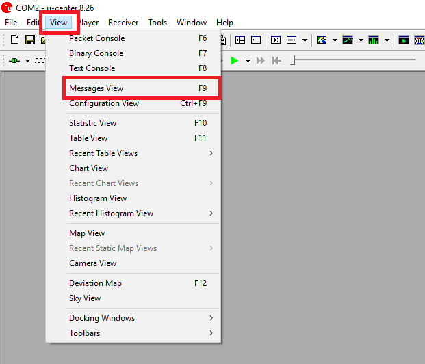
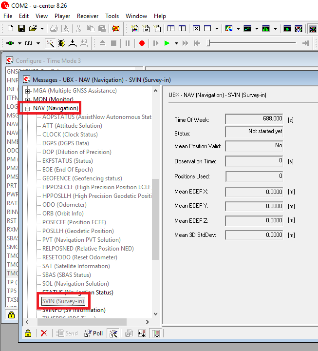
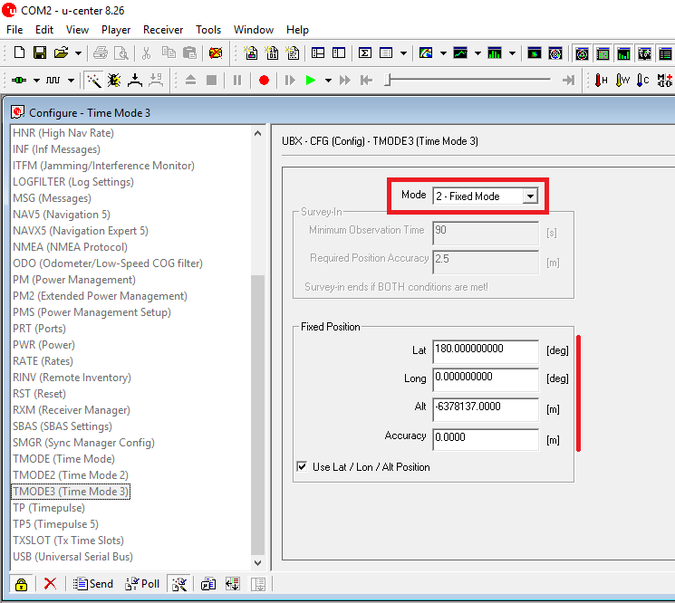
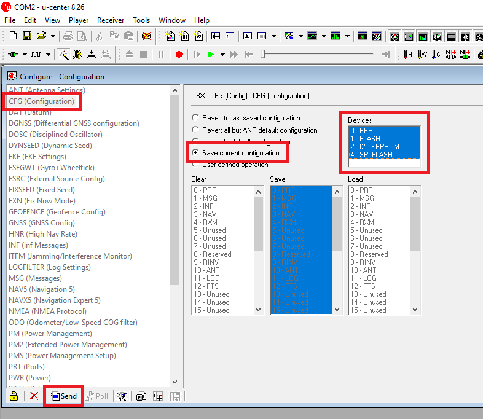

# Configuring the base manually

You can use the Ucenter software in order to configure precisely the behavior of the M8P chip so that it will achieve exactly what you want.

In order to configure the base, you need:

* 1 Computer, used as ground control station
* 1 Micro USB cable
* **Latest** version of UCenter Software \(available [here](https://www.u-blox.com/en/product/u-center-windows)\)

## Configuring the Ublox chip

First of all, install the UCenter software on your computer. When done, you can connect your base module to your computer. Open the UCenter software after that, and connect it to your base module using the button in the upper-left corner.

After connecting, you should be able to enter the Configuration view from the top hotbar.

_Note : After any modification made in the Configuration panel, always remember to hit the Send button at the bottom of the configuration view panel, or your modifications won't be stored!_

In this menu, scroll down on the left panel to find the _MSG \(Messages\)_ menu. There, open the slide down menu and pick the RTCM1005 messages. After that, check both UART1 and USB checkboxes and click on the _Send_ button.

You must repeat these steps for the _RTCM1077_, _RTCM1087_ and _RTCM1127_ messages \(respectively GPS, GLONASS and BEIDOU raw data\) without omitting to hit the _Send_ button each time, or your changes won't be applied. Checking both UART1 and USB checkboxes will allow the chip to send the messages either from USB or UART1, depending on your system setup.

Next, move to the _TMODE3 \(Time Mode 3\)_ section on the left panel. You will be able in this section to chose whether you'll use **Survey-in** \(if you don't have an exactly known position for your base\) or **Fixed** \(if you know the exact position of your base, either in _ECEF_ or _Lat/Lon/Alt_ format\) mode.

In **Survey-in mode**, your base will determine its position by itself. You will have to set a minimum surveying time and a minimum accuracy. The surveying will last _at least_ for the duration you set, and _won't stop_ until it has reached the accuracy you selected. Don't forget to click the _Send_ button after setting up the surveying.

After setting up these values, you can get to the _SVIN_ menu to check the informations gathered by the base, as its position, time, surveying time, and other useful data. To do so, open the Messages view from the top hotbar, and scroll down to the \_NAV \(Navigation\)\_section, then look for the SVIN message.

In **Fixed mode**, the surveying is not done, and you have to enter the position of the base yourself, whether it be in _ECEF_ or _Lat/Lon/Alt_ format. Keep in mind that having the most accurate positioning for your base will provide best results in order to compute the position of the rover module.

At this point, your base is almost set up. You have to encapsulate raw data in your telemetry link then. This will only require you to have your base and control station \(computer\) connected through USB. To set this up, you will first need to save the whole configuration you've done, by getting into the _CFG \(Configuration\)_ menu on the left panel, selecting all four memories on the right, and clicking _Send_.

