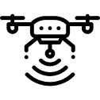

# The Rover

The rover module is meant to be mounted on the vehicle that's moving. Whereas the base is supposed to be immobile \(even though it can be mobile, which implies a loss of accuracy\), the rover is the module receiving the corrections, providing the informations to the autopilot with it's position, heading, height...

