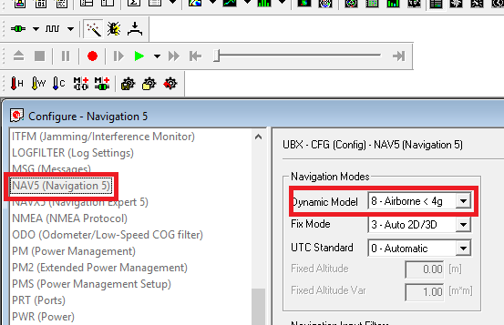

# Configuring the rover manually

You may want to configure the U-blox chip if you're using a dedicated telemetry link to connect your base and rover module, instead of encapsulationg it in the MAVLink protocol.

You can use the U-center software in order to configure precisely the behavior of the M8P chip so that it will achieve exactly what you want.

In order to configure the rover, you need:

* 1 Computer, used as ground control station
* 1 Micro USB cable
* **Latest** version of U-Center Software \(available [here](https://www.u-blox.com/en/product/u-center-windows)\)

## Configuring the U-blox chip

First of all, install the U-Center software on your computer. When done, you can connect your rover module to your computer. Open the U-Center software after that, and connect it to your rover module module using the button in the upper-left corner.

After connecting, you should be able to enter the Configuration view from the top hotbar.

_Note : After any modification made in the Configuration panel, always remember to hit the Send button at the bottom of the configuration view panel, or your modifications won't be stored!_

In the Configuration panel, scroll down to the _PRT \(Port\)_  section. Here, you need to enter **your autopilot's GPS port's baudrate** to allow it to communicate correctly. It is necessary, as the link between your GPS and the telemetry is purely serial, and there's no other protocol to stipulate a baudrate.

It is also necessary to modify the frequency of the chip. To do this, on the left panel, look for the _RATE \(Rates\)_ menu and modify the _Measurement period_ to 200 ms.

_Don't forget to click Send!_

Next, get into the _MSG \(Messages\)_ menu and disable all NMEA messages.

After disabling the NMEA messages, you should also enable the following messages for the UART1 link:

* NAV-POS-LLH
* NAV-STATUS
* NAV-SOL
* NAV-VELNED

To do so, find each messages in the droplist and check the _UART1_ box for each of these messages, without omitting to click _Send_ for each message.

Modifying the dynamic filter can also help. You can change it in the _NAV5 \(Navigation 5\)_ menu, using the first droplist at the top of the menu.

After doing this tweak, all that is necessary is to save the whole configuration you've done, by getting into the _CFG \(Configuration\)_ menu on the left panel, selecting all four memories on the right, and clicking _Send_.

Now that the configuration is stored into the chip, you can disconnect your RTK module from the computer and plug it to your autopilot!

