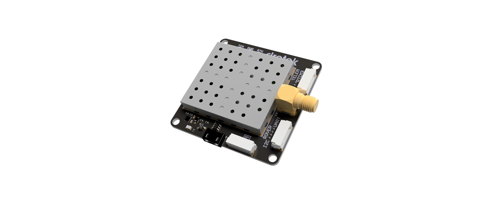
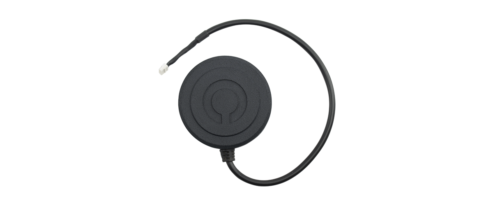

# Chips features

## ZED-F9P chip

### Highlights:

* **Multi-band** receiver delivers centimeter-level accuracy in seconds.
* Concurrent reception of GPS, GLONASS, Galileo and BeiDou.
* Multi-band RTK with fast convergence times and reliable performance.
* **High update rate** for highly dynamic applications.
* Centimeter accuracy in a small and energy-efficient module.
* Easy integration of RTK for fast time-to-market.

### Features:

* Receiver: **184-channel** GPS L1/L2 , GLONASS L1/L2, BeiDou B1/B2, GALILEO E1/E2.
* Nav. update rate: up to **20** Hz.
* Position accuracy: 1 cm.
* Serial interfaces: 2 UART, 1 SPI, 1 USB, 1 DDC \(I2C\).
* Power consumption: ~68 mA.
* Chip size: 17 x 22 x 2.4 mm.

## NEO-M8P chip

### Highlights:

* **Centimeter‑level** GNSS positioning for the mass market.
* Integrated Real Time Kinematics \(RTK\) for fast time‑to‑market.
* Complete and versatile solution due to base and rover possibility.
* World‑leading GNSS positioning technology.

### Features:

* Receiver: **72-channel** GPS L1 , GLONASS L1, BeiDou B1, GALILEO E1.
* Nav. update rate: up to **8** Hz.
* Position accuracy: 2.5 cm.
* Serial interfaces: 1 UART, 1 SPI, 1 USB, 1 DDC \(I2C\).
* Power consumption: ~25 mA.
* Chip size: 12.2 x 16.0 x 2.4 mm, 1.6 g.

