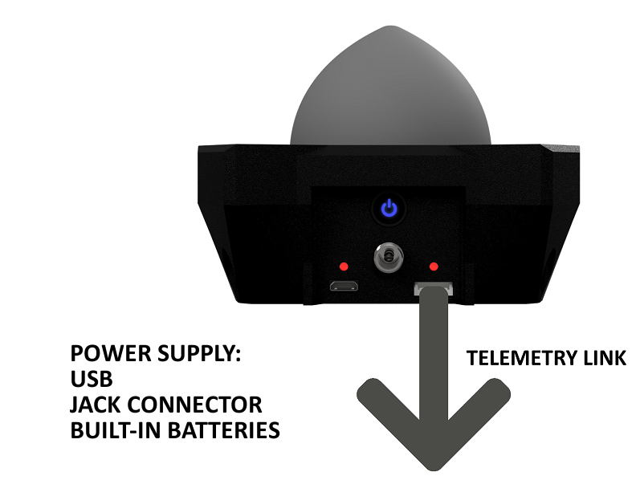

# Simplified schematics

## Tiny RTK GNSS \(M8P\)

## XL RTK GNSS \(M8P\)

Switch position :

* _Base_ use-case : **TELEM**
* _Rover_ use-case : **ROVER**

## Sirius RTK GNSS Base \(M8P\)

## Sirius RTK GNSS Rover \(M8P\)

