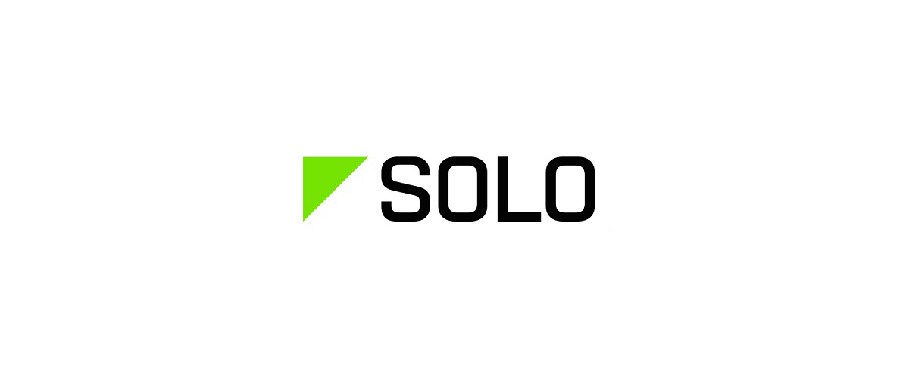

# 3DR Solo RTK module

## 3DR Solo RTK module

During the year 2016, Drotek developed a replacement board for the 3DR Solo's GNSS receiver. Available with the M8N chip \(non-RTK precision U-blox chip\) and the M8P \(RTK capacity\) chip, it can be used easily in order to bring RTK accuracy to your 3DR Solo drone!

As it is specifically designed for the 3DR Solo drone, you will find a specific section in this book concerning this RTK module, what is necessary to configure it, how to install the board replacing the original GNSS receiver located inside the drone, and how to upgrade the firmware of the drone to allow RTK usage. You will find below the specifications of the 3DR Solo RTK module and it's wiring.

### _Input / Outputs_

The 3DR Solo RTK module features:

* 1 MicroUSB connector
* 1 Clik-Mate female connector

[Shop the product here](https://drotek.com/shop/en/home/812-gps-rtk-solo-3dr-neo-m8p.html).

## Specifications

Specs:

* Size \(_Lxlxh_\) : 50 x 42 x 10.2 mm.
* Weight : 18 g.

## Wiring

_Note: The wiring is given for informational purpose only, but the 3DR Solo RTK module is meant to be used with the 3DR Solo drone, so you should not need to re-wire it in a normal use-case._

| Wire N° | Corresponding pinout |
| :--- | :--- |
| C1 | GROUND |
| C2 | _**NC**_ |
| C3 | _**NC**_ |
| C4 | TX |
| C5 | RX |
| C6 | 5V IN |

