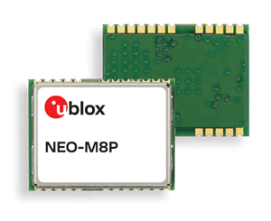

## Highlights :

* **Centimeter‑level** GNSS positioning for the mass market.
* Integrated Real Time Kinematics (RTK) for fast time‑to‑market.
* Smallest, lightest, and energy‑efficient RTK module.
* Complete and versatile solution due to base and rover variants.
* World‑leading GNSS positioning technology.

 

## Features:

* u-blox NEO-M8P.
* Plug and play module.
* Receiver: 72-channel GPS L1 , GLONASS L1, BeiDou B1, GALILEO E1.
* Nav. update rate: up to 8 Hz.
* Position accuracy: 2.5 cm.
* Data link: whatever can be connected to a UART : Bluetooth, 433-868-915 MHz radio link, XBee, WiFi….
* Power consumption: 25 mA.
* Power supply: 5V (Tiny and XL version), 12V (XXL version).
* Chip size: 12.2 x 16.0 x 2.4 mm, 1.6 g.
 

## Interfaces:

* UART serial port (JST-GH connectors).
* USB V2.0 full speed port.
* SMA connector for active GPS (Tiny and XXL version).
* I2C connector (only for XL version).
* EXTINT input from NEO-M8P.
* Protocols: NMEA, UBX binary, RTCM version 3.x.
