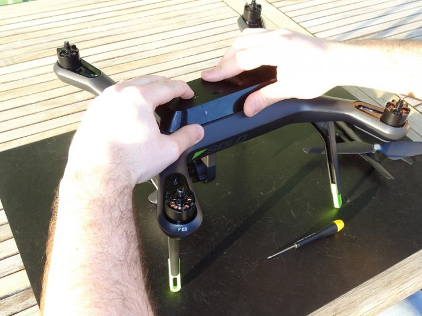
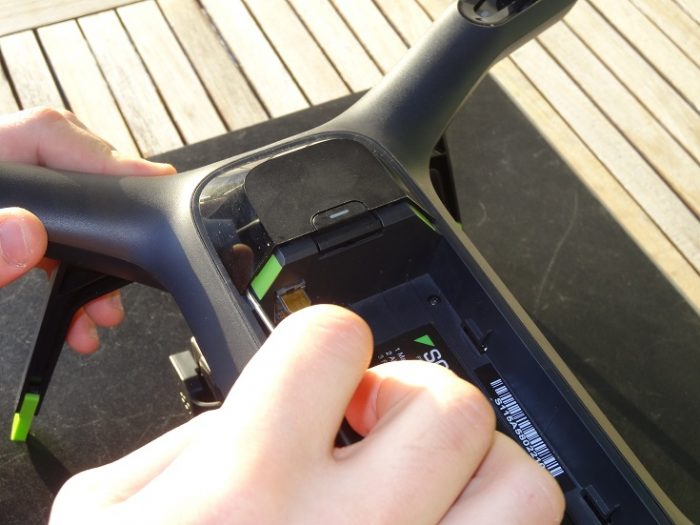
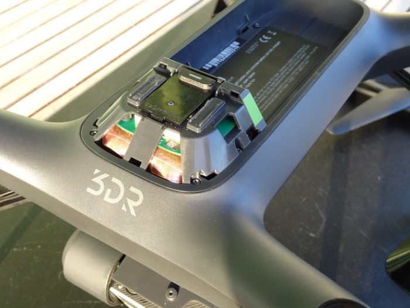
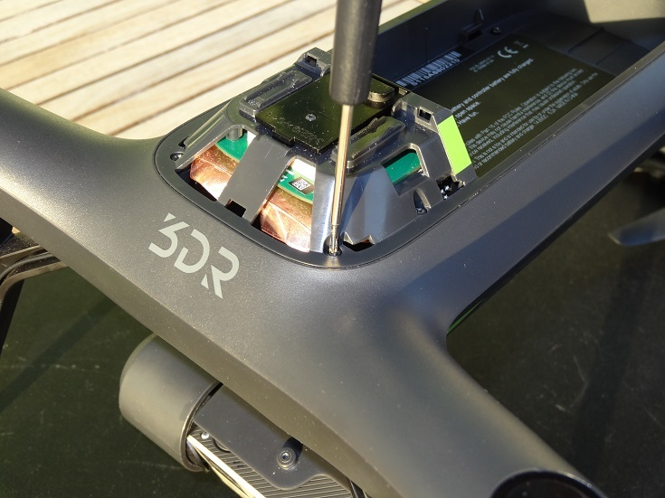
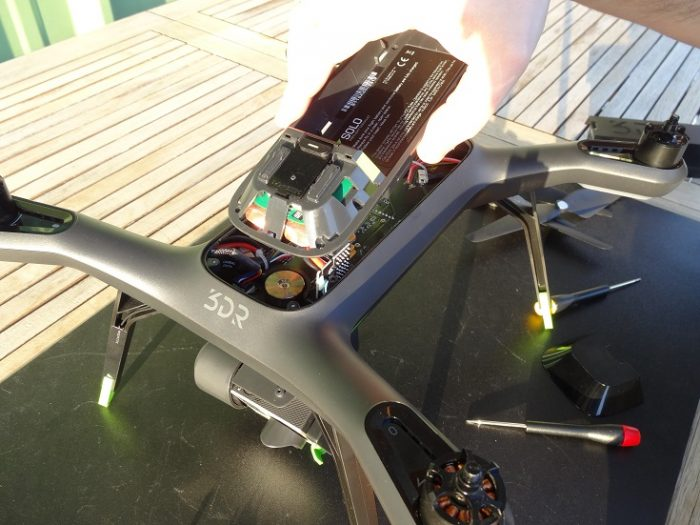
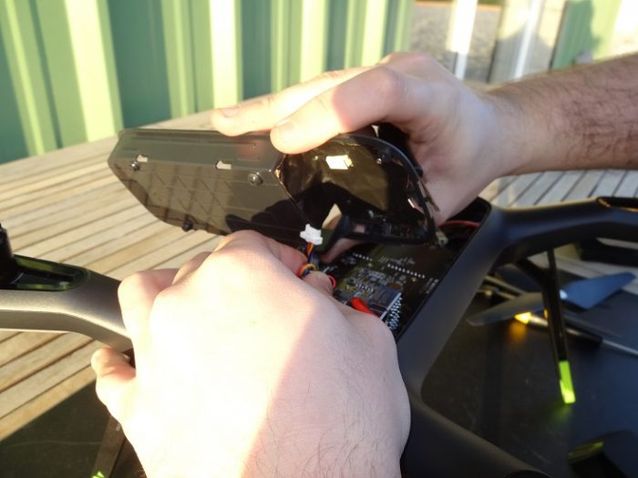
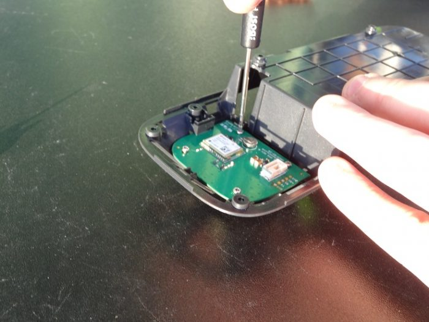
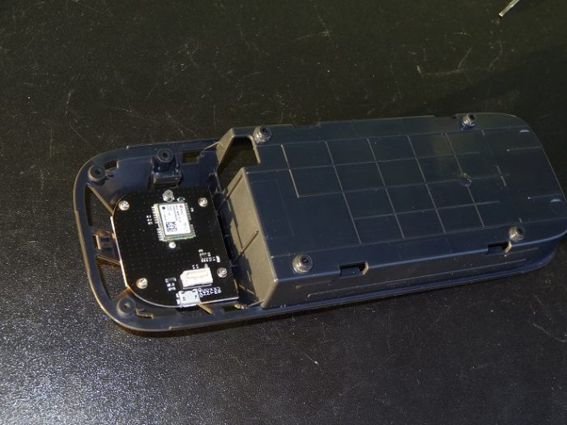
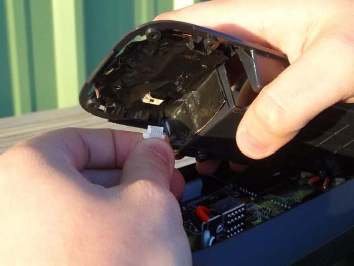
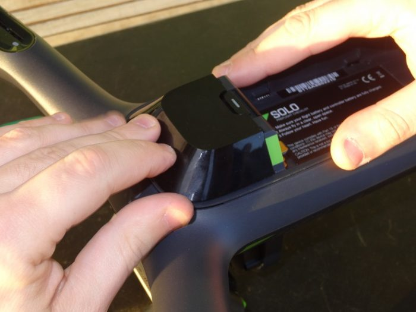

# Installing the module

In order to install your Solo RTK module, you will need:

* 1 small cross-headed screwdriver
* 1 small flat screwdriver
* 1 3DR Solo Drone
* 1 3DR Solo RTK module 

_Note: This installation process can be applied for the M8N and M8T version of the Drotek Solo GNSS receiver._

Before doing anything, take off the propellers and battery from the drone.

Slightly pull the side locks out from the case using the flat screwdriver in the lower corner the same way as in the picture below.

Do the same with the upper locks using the flat screwdriver to unlock and pull out the GPS top case.

Next, use the crossheaded screwdriver to take off the 7 screws of the top block.

Then slightly lift the block up to allow unplugging the GPS board that's inside the block.

Unplug the Clik-mate connector carefully from beneath the block.

You can now use the cross-headed screwdriver to free the GPS boards drom the case. You should be able to take it out of after that.

Now, place the Drotek Solo RTK module into the case, the antenna patch facing the upper side of the block \(the antenna patch need to be facing the sky for a correct communication\). When it's in place, you can screw it into the block again.

After locking the board with the screws, plug the Clik-mate connector back into the Drotek Solo RTK board.

Then, after placing the block into the drone and screwing back the seven screws for the block.

After putting the block back in place, you can put the GPS top case back onto the drone, by sliding it from the front of the drone, applying slight pressure to push it and lock it well.

You can then install your battery and propellers back onto the drone before getting to the next step.

