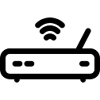

# The Telemetry system

The role of the telemetry link is to allow communication between the rover and base module. In the case you encapsulate the RTK data into the MAVLink, the telemetry link providing communication between rover and base modules is the telemetry link between your base control station \(usually a computer\) and your autopilot. In other cases, you may need to use an external telemetry kit to link your rover and base module.

It is possible to use many systems for this role, but in this book, I will only introduce you to Drotek's homemade 433 MHz telemetry kit and a generic 500 mW telemetry kit.

Keep in mind that most systems that have a UART port are capable of being used for RTK communication.

