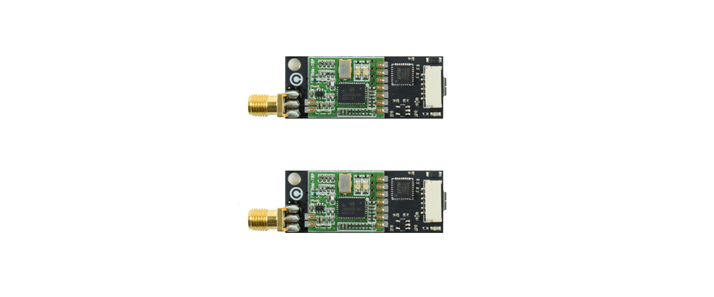

# Choosing a telemetry system

Depending on the requirements of your system, you may want to chose one telemetry setup or another. The main characteristics of the telemetry link are it's range, and it's communication speed, that have to be adapted to your RTK configuration and your general application to achieve the best results.

## _Overview_

### Drotek Telemetry Kit

Drotek's _433/915 MHz Telemetry kit_ can very easily be used with Drotek's RTK modules. Already configured in factory, it is **plug-&-play** with the RTK modules and will offer **more than a kilometer** of range for your system \(using the right antennas\). Available in both **433 MHz** or **915 MHz**, it can output 100 mW, and it's range can be upgraded by using a bi-directional amplifier or installing omni-antennas.

[Product page with more informations](https://drotek.com/shop/fr/rf/795-kit-radio-telemetrie-433-915-mhz.html).

