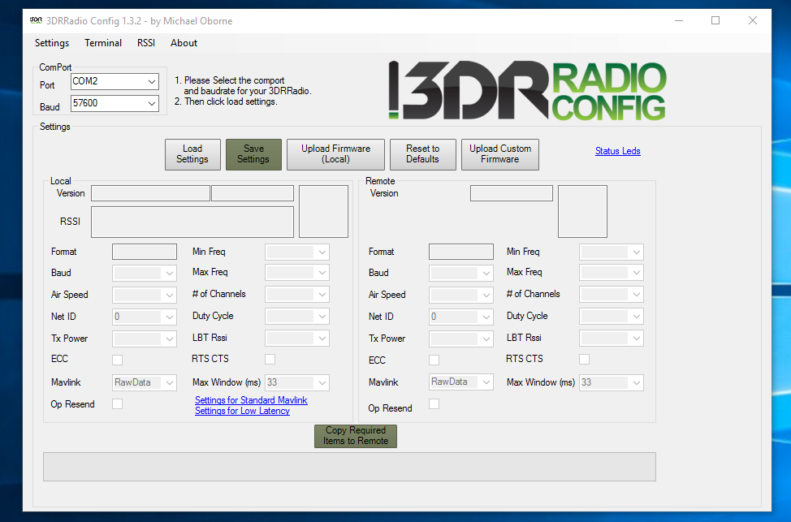
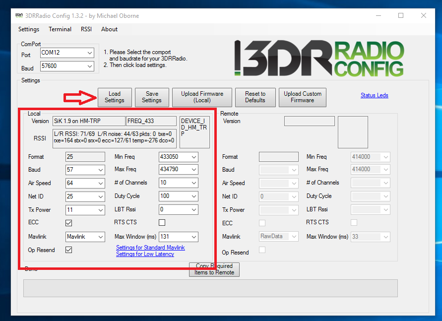

# Configuring telemetry for RTK

## Configuration of the telemetry kit

The Drotek telemetry kit is built to be plug-&-play. It is not necessary to manually configure the kit, as the values and rates are either configured in factory to match the RTK modules settings or automatically configured by Mission Planner or QGroundControl to be used for the RTK application.

However, if you're not using an autopilot system with you RTK setup, manually configuring your telemetry kit can help achieve what you want to do.

## Manually configuring the telemetry kit for a system with no MAVLink

As said above, using an RTK system without an autopilot \(without MAVLink then\) implies to configure the telemetry kit according to your RTK setup.

It is important to note that **all baudrates, for the RTK modules as well as both telemetry boards must be the same**.

To configure your telemetry boards, you will need to download the _3DR Radio Config_ software. You can download it from [this link](http://vps.oborne.me/3drradioconfig.zip). It doesn't require you to install it. When downloaded, extract the archive to a location on your PC of your choice, and then start the software by opening the _3DRRadio.exe_ file.

This is almost the same as the Mission Planner telemetry setup menu. You first need to connect to your telemetry board. To do this, simply choose the COM port and baudrate of your telemetry \(default is 57600\) and click _Load Settings_ in order to get the current setup of your board. You will see the software gathering the informations from the board and display them for you.

If your two telemetry boards are linked \(_Green LED solid_\), the software will also display the configuration of the second module on the right _Remote_ panel. It is possible to configure one of the two modules, and then upload the modified settings to the second one by clicking the _Copy required items to remote_ button at the bottom of the window.

The main parameters you can tweak are:

* **Baud** : This will define the baudrate of the telemetry radio. In an RTK setup, it is **absolutely necessary** to have the same baudrate for all the devices implied in the communication process \(GPS chips and telemetry radios\). \(Note that the values are shown in _one byte format_, which correspond to the first digits of the desired baudrate. For instance, _57_ corresponds to the _57600_ baudrate, _115_ stands for _115200_, etc...\)
* **Net ID** : This is the ID of your telemetry board. If the Net ID of your two boards is the same, then the two will be able to connect to each other. If the Net ID is different between one telemetry board and the other, then they won't be able to connect together. This allows to setup different networks when several telemetry boards are being used. 
* **Airspeed** : This parameter will select the speed at which the two telemetry boards will communicate with each other. Increasing this value will imply a diminution of the range, whereas deminishing this value will grant a longer range. The value is expressed in Kb/s.

There are other parameters that you can tweak, but these are the main settings to take care of in order to have a stable and customized setup.

You can find informations on all the parameters by following [this link](http://ardupilot.org/copter/docs/common-configuring-a-telemetry-radio-using-mission-planner.html). The software used is Mission Planner but the operation is the same.

