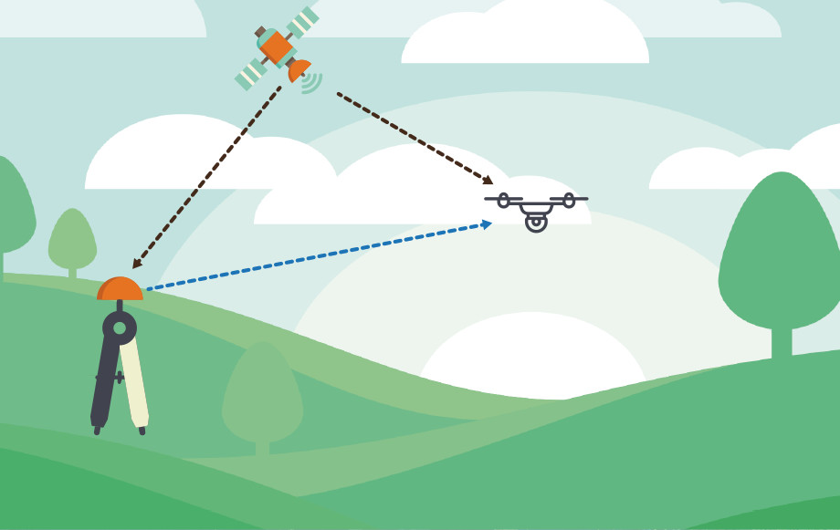

# What is RTK?

First, let’s understand what **RTK **really stands for! **Real Time Kinematics **is a GNSS technology that allows to partially remove signal errors due to propagation in the atmosphere. These errors are numerous:

* Atomic clocks biases
* Receiver’s noise
* Antenna’s phase center variation
* Multipath
* Troposphere propagation
* Ionosphere propagation

Ionosphere propagation is the most important effect. The ionization of the propagating medium causes reflections and refractions of the electromagnetic waves. The propagation time measurement time performed by the receiver is therefore false.

Another important effect that cannot be modeled is **multipath**. It corresponds to wave reflection on obstacles near the receiver \(trees, buildings…\) that retard or duplicate signals. It can be strongly attenuated with a good hardware.

**RTK **requires consequently two GNSS receivers, a “base” station, generally motionless and whose position is perfectly known, and a “rover” mobile receiver. The base sends correction data to the rover \(raw data\) so that the rover can compute the double-difference RTK algorithm. This means that pseudoranges and carrier phases from the base will be “substracted” \(it is a bit more complicated though\) from those from the rover. **RTKLIB **is used to perform those calculations, that can lead to a centimeter-level accuracy.

To get deeper into details, **RTK **uses carrier measurements in order to get **centimetric**. GPS signal wavelength is about 20 centimeters, so if you are able to measure the phase of this signal, that you know satellite’s phase center and that you calculate the integer number of periods between the satellite and you, this is where you get to centimetric precision. We call ambiguity the previous integer number of periods. If the algorithm finds an integer solution, then the solution is called a “**fix**“. This is when when maximum accuracy is reached. Otherwise, if the solution is a float, the solution is called “**float**“. This solution is less precise. We will refer as “**single**” for the positions neither “fix” nor “float” \(happens if no correction data is received, or if signals are not good enough\). Something really important about **RTK **is that if your antennas do not provide good enough signals, the computed position will easily be erroneous!

